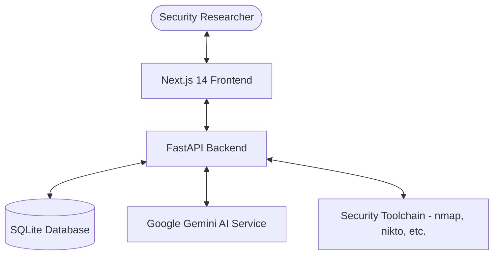

# Architecture Overview

HackMate v2.0 is a modern, full-stack penetration testing platform designed for security professionals. It follows a modular architecture with a clear separation between the frontend, backend, and AI service layers.

## 🏗️ System Architecture

### 1. Frontend (Next.js 14)
- **Framework**: Next.js 14 with App Router.
- **State Management**: TanStack Query (React Query) for server-state management and synchronization.
- **Styling**: Tailwind CSS with a custom "Hacker" theme (dark mode, neon green accents).
- **Icons**: Lucide React.
- **API Communication**: Axios-based client with centralized request handling.

### 2. Backend (FastAPI)
- **Framework**: FastAPI for high-performance asynchronous API endpoints.
- **ORM**: SQLAlchemy for database abstraction and management.
- **Validation**: Pydantic for request/response serialization and validation.
- **Security**: 
    - Command whitelisting for tool execution.
    - Scope enforcement for automated scans.
    - Environment-based configuration management.

### 3. Data Layer (SQLite)
- A relational database storing engagements, PTES phases, findings, scan results, terminal history, and chat logs.
- Integrated migrations and easy setup for local environments.

### 4. AI & Service Layer
- **Google Gemini Integration**: Provides intelligent guidance, output analysis, and report generation.
- **Terminal Service**: Handles safe execution of command-line tools within a sandboxed or restricted environment.
- **Report Service**: Consolidates engagement data into professional Markdown and JSON formats.

## 📁 Key Directories

- `backend/models/`: Database schema definitions.
- `backend/routers/`: Modular API endpoint definitions.
- `backend/services/`: Core business logic and external integrations.
- `frontend/src/app/`: Next.js pages and routing logic.
- `frontend/src/components/ui/`: Reusable stylistic components.
- `frontend/src/lib/api/`: Centralized backend communication logic.
